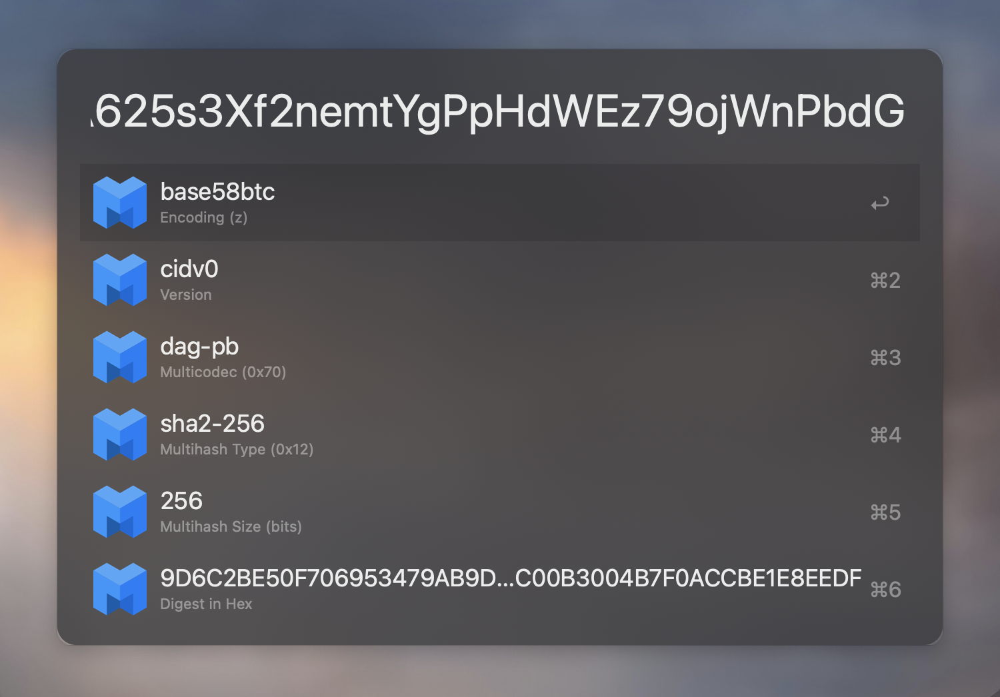

# Alfred CID Decoder

An [Alfred](https://www.alfredapp.com/) workflow to decode multiformats [Content Identifiers](https://github.com/multiformats/cid).

## Table of Contents

- [Table of Contents](#table-of-contents)
- [Download](#download)
- [Usage](#usage)
- [Maintainers](#maintainers)
- [Contributing](#contributing)
- [License](#license)

## Download

Click [here](https://github.com/dennis-tra/alfred-cid-decoder/releases/tag/1.0.1) and download `cid-decoder.alfredworkflow`.

## Usage

Enter `cid` followed by the content identifier. That's it.

Pressing `enter` copies the selected item like the multihash type or the hex digest.

## Maintainers

[@dennis-tra](https://github.com/dennis-tra).

## Contributing

Feel free to dive in! [Open an issue](https://github.com/dennis-tra/alfred-cid-decoder/issues/new) or submit PRs.

Standard Readme follows the [Contributor Covenant](http://contributor-covenant.org/version/1/3/0/) Code of Conduct.

## License

[MIT](LICENSE) © Dennis Trautwein
